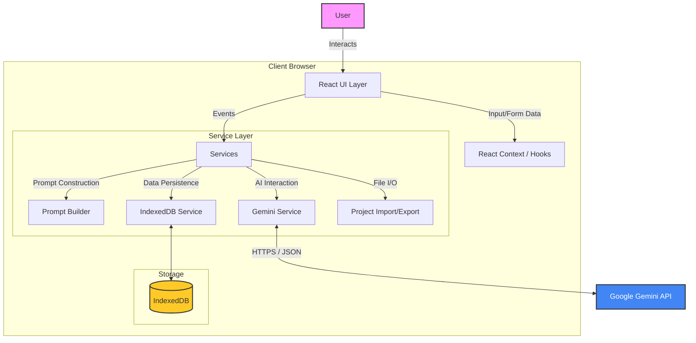
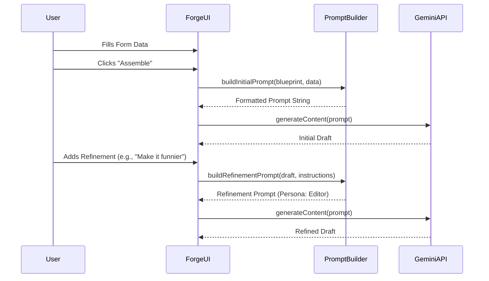

# Prompt Forge AI: Comprehensive System Analysis

**Date:** October 27, 2024
**Scope:** Full Repository Codebase Review
**Perspectives:** Software Architect, Software Developer, Product Manager

---

## 1. Architectural Perspective

### System Overview
Prompt Forge AI is a Client-Side Single Page Application (SPA) designed to facilitate the creation and refinement of Large Language Model (LLM) prompts. It utilizes a "No-Build" architecture, leveraging modern browser capabilities (ES Modules) and CDNs (`esm.sh`, `tailwindcss`) to load dependencies at runtime.

### High-Level Architecture Diagram

### Critical Architectural Decisions

#### 1. The "No-Build" Approach
*   **Implementation:** The app uses `index.html` with an import map to load React, ReactDOM, and Google GenAI SDK from `esm.sh`. There is no Webpack, Vite, or Rollup configuration.
*   **Architectural Trade-off:**
    *   *Pros:* Zero tooling configuration, immediate deployment (static file serving), extremely low barrier to entry for reading the code.
    *   *Cons:* Performance "waterfall" on initial load (no bundling), lack of tree-shaking, potential version fragility (relying on CDN availability), harder to integrate advanced testing frameworks or static analysis tools (ESLint/Prettier) in a standard CI/CD pipeline.

#### 2. Local-First Persistence
*   **Implementation:** `dbService.ts` abstracts `IndexedDB`.
*   **Architectural Trade-off:**
    *   *Pros:* Privacy-centric (data stays on device), no backend cost/complexity, works offline (mostly).
    *   *Cons:* Data is siloed to the specific browser/device. No collaboration or cross-device sync without manual file export/import.

#### 3. Configuration-Driven UI
*   **Implementation:** `constants.ts` defines "Blueprints". The UI (`RawMaterialsPanel`, `DynamicField`) renders entirely based on these JSON-like configuration objects.
*   **Architectural Trade-off:**
    *   *Pros:* High extensibility. Adding a new domain (e.g., "Marketing Copy") requires no UI code changes, just a new entry in `constants.ts`.
    *   *Cons:* UI is tightly coupled to the structure defined in `types.ts`. Complex, custom UI layouts for specific blueprints are difficult without refactoring the schema.

---

## 2. Software Developer Perspective

### Codebase Structure & Quality

The codebase is organized into a clear separation of concerns, following standard React patterns despite the non-standard build setup.

| Directory | Purpose | Quality Assessment |
| :--- | :--- | :--- |
| `components/` | Reusable UI | **High.** recently refactored into `panels/` for better organization. `DynamicField` handles complex inputs well. |
| `services/` | Business Logic | **High.** `geminiService.ts` and `dbService.ts` isolate side effects effectively. |
| `hooks/` | State Logic | **Medium.** `useProjectHistory` is useful, but `App.tsx` handles routing manually, which is brittle. |
| `contexts/` | Global State | **Medium.** `ProjectContext` is simple but effective for this scale. |
| `pages/` | View Logic | **Medium/High.** Wrappers around `ForgeUI` that inject specific blueprints. |

### Key Algorithms & Logic

#### Prompt Generation Flow (`services/promptBuilder.ts`)
The application uses a two-stage prompt engineering process:
1.  **Assembly:** `buildInitialPrompt` takes structured form data and wraps it in XML tags (`<user_raw_ideas>`, `<task_instructions>`) to create the base prompt.
2.  **Refinement:** `buildRefinementPrompt` wraps the *output* of the previous step in a new context, acting as an "Editor" persona.

### Maintainability Concerns
1.  **Type Safety:** While TypeScript interfaces (`types.ts`) are defined, the "no-build" environment means type checking relies entirely on the IDE. There is no compile-time safety net before deployment.
2.  **Routing:** `App.tsx` uses a simple string state (`currentPage`) to switch components. This breaks browser back/forward buttons and deep linking.
3.  **Styles:** Tailwind classes are used inline. While standard, the lack of component abstraction for buttons/inputs leads to repetitive class strings (e.g., `bg-gray-700 border border-gray-600...`).

---

## 3. Product Manager Perspective

### Value Proposition
Prompt Forge AI solves the "Blank Canvas Paralysis" problem for prompt engineering. It bridges the gap between a vague idea and a technically structured prompt for software, writing, or game design.

### Feature Analysis

| Feature | Status | User Value | UX Friction |
| :--- | :--- | :--- | :--- |
| **Blueprints** | Polished | **Critical.** Guides users through structured thinking. | Low. Very intuitive. |
| **Inspire Me** | Functional | **High.** Unblocks users who have only partial ideas. | Low. "Magic" button experience. |
| **Refinement** | Polished | **High.** Allows iteration without rewriting everything manually. | Medium. Users must understand "sliders" for creativity/strictness. |
| **History** | Functional | **Medium.** Safety net for experimentation. | Medium. Hidden behind a toggle. |
| **Project Lib** | Functional | **High.** Persistence is key for serious work. | High. Lack of cloud sync creates anxiety about data loss. |

### User Flow Analysis

1.  **Onboarding:** `GettingStartedPage` provides a decent overview, but the lack of an interactive tutorial might leave non-technical users confused about *why* they need a structured prompt.
2.  **The "Forge" Experience:** The split-screen (Raw Materials vs. Forge) is excellent. It visually reinforces the transformation of data into instruction.
3.  **Output:** Providing Token Counts and multiple formats (JSON/XML/Markdown) caters heavily to power users (Developers), effectively positioning the tool as a "Pro" utility.

### SWOT Analysis

*   **Strengths:** niche-specific templates (Game Dev, Coding), privacy-focused (local storage), zero-cost hosting.
*   **Weaknesses:** No mobile responsiveness optimization (desktop focused), no cloud sync, dependent on user's own API Key (friction).
*   **Opportunities:** Community template library (users sharing blueprints), "One-click send to ChatGPT/Claude" (deep links), Browser Extension version.
*   **Threats:** API cost changes, LLMs getting better at zero-shot prompting (reducing need for complex prompt engineering).

---

## 4. Actionable Recommendations

### Short Term (Quick Wins)
1.  **Routing Upgrade:** Implement `react-router-dom` (even via CDN) to enable browser history navigation.
2.  **UI Component Library:** Extract button and input styles into reusable components to clean up the code and ensure visual consistency.
3.  **Mobile Polish:** Tweaking the layout to stack panels on mobile devices is partially there, but interaction with large text areas on mobile needs refinement.

### Medium Term (Architectural Improvements)
1.  **Migrate to Vite:** Transitioning to a standard build process is highly recommended.
    *   *Why:* Enables tree-shaking, faster load times, unit testing (Jest/Vitest), and static type checking.
2.  **Prompt Sandbox:** Add a "Test Run" feature where the generated prompt is immediately sent to a separate chat window within the app to see the *actual* result of the prompt, closing the feedback loop.

### Long Term (Strategic)
1.  **Cloud Backend:** Implement a lightweight backend (Firebase/Supabase) to allow "Sign In with Google". This unlocks:
    *   Cross-device sync.
    *   Sharing projects via URL.
    *   Community Library.
